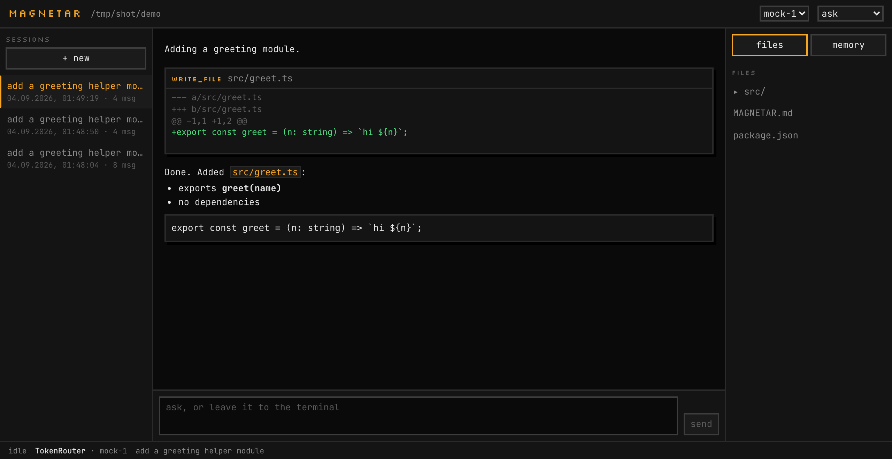
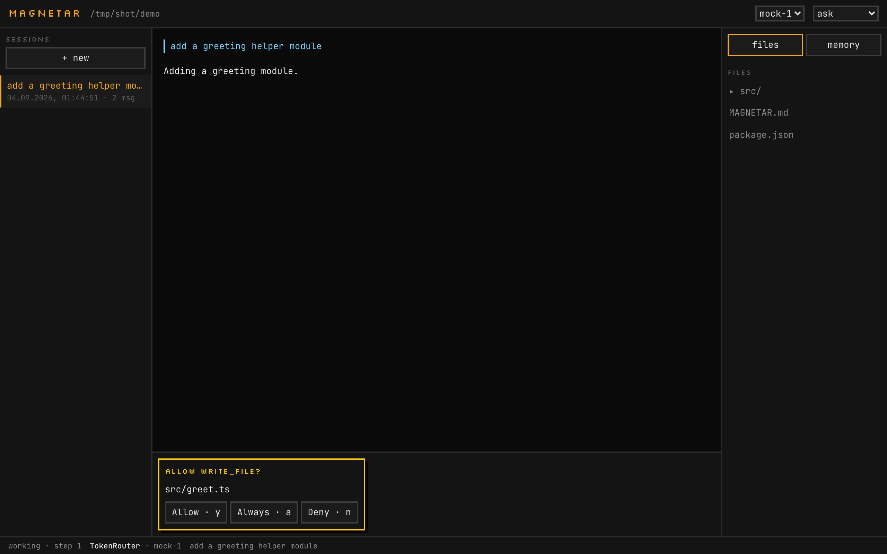

<div align="center">

# ▚ Magnetar Code

**Агент для кода, который живёт в терминале — и локальный монитор к нему в браузере.**

BYOK. Любой OpenAI-совместимый эндпоинт: OpenRouter, TokenRouter, Kimi, OpenAI,
DeepSeek, Together, LM Studio, Ollama.

[English](README.md)

</div>

```bash
npm i -g magnetar-code
magnetar provider     # выбрать пресет, вставить ключ
magnetar              # начать работу в текущей папке
```

---

## Монитор

`magnetar web` открывает ту же сессию в браузере: живой поток, каждый вызов
инструмента с его диффом, дерево файлов с пометкой изменённых, план работ и
память проекта — редактируемую на месте.



Это не второй чат. Это окно в тот прогон, который уже идёт у тебя в терминале —
одни и те же сессии и один и тот же контекст, откуда бы ты ни смотрел.

## Ты подтверждаешь действия

Инструменты только для чтения работают свободно. Всё, что меняет машину,
останавливается и спрашивает — в терминале или в браузере, смотря куда ты
смотришь.



`y` — разрешить один раз, `a` — больше не спрашивать про эту команду в этом
проекте, `n` — отказать и объяснить модели почему. Команды вроде `git status`
не дёргают вообще: пятый одинаковый безобидный вопрос — это ровно то, что
приучает жать «да» не читая.

## Зачем ещё один

Большинство таких штук — это окно чата с прикрученной файловой системой. Этот
собран вокруг трёх вещей, которые реально ломаются:

**Он останавливается.** Потолок шагов, бюджет в долларах и отмена, которая
убивает запущенную команду. Агент не должен крутиться, пока это не заметит
кошелёк.

**Он не выходит за пределы проекта.** Любой путь резолвится внутри рабочей
папки. `../../.ssh/id_rsa` — отказ, а не чтение.

**Он не теряет работу.** Сессии — append-only файлы со сбросом на каждом ходу,
падение посреди задачи её не стирает. Транскрипт сжимается сам, до того как
переполнится окно, а не умирает на 400 от провайдера.

Ключ уходит в системный keychain — не в конфиг и не в браузер. Запросы делает
Node-процесс, монитор видит только текст.

## Свой ключ

```bash
magnetar provider
```

Выбираешь эндпоинт из списка, вставляешь ключ, выбираешь модель — список
моделей подтягивается с эндпоинта, в каком бы формате он ни ответил. Локальным
(LM Studio, Ollama) ключ не нужен вовсе.

## Скрипты и CI

```bash
magnetar -p "какие роуты есть в этом приложении?"
cat error.log | magnetar -p "почему падает"
magnetar -p "добавь health check" --permission-mode auto-edit --output-format json
```

`--output-format json` печатает ответ, id сессии, число шагов, токены и
стоимость одним объектом. В скрипте за клавиатурой никого нет, поэтому
инструмент, которому нужно подтверждение, получает отказ, а не висит.

## В сессии

Нажми `/` — откроется палитра: `/model`, `/sessions`, `/cost`, `/context`,
`/diff`, `/undo`, `/compact`, `/init`, `/memory`, `/permissions`, `/export`,
`/web`, `/doctor`.

`enter` отправляет · `\` и `enter` — новая строка · `↑` `↓` — история ввода ·
`esc` останавливает ход · двойной `ctrl+c` выходит.

## Память проекта

`MAGNETAR.md` в корне репозитория попадает в каждый системный промпт: команды
сборки, соглашения, грабли — всё, что рассказал бы новому разработчику. `/init`
пишет первый вариант, прочитав репозиторий. Отдельные факты лежат по файлу на
факт в `.magnetar/memory/`, так что всё, чему научили агента, видно в диффе и
коммитится как обычный код.

## Флаги

```
-p, --print <текст>      ответить один раз и выйти
    --output-format      text | json
-m, --model <id>         модель на этот прогон
-C, --cwd <папка>        работать в другой папке
-c, --continue           продолжить последнюю сессию здесь
-r, --resume <id>        продолжить конкретную сессию
    --permission-mode    ask | auto-edit | yolo
    --max-steps <n>      остановиться после n шагов (по умолчанию 25)
    --max-cost <usd>     остановиться на этой сумме
```

## Репозиторий

| Пакет           | npm                                                            | Что это                                                    |
| --------------- | -------------------------------------------------------------- | ---------------------------------------------------------- |
| `packages/core` | внутренний                                                     | Провайдеры, agent loop, инструменты, сессии, память, демон |
| `packages/cli`  | [`magnetar-code`](https://www.npmjs.com/package/magnetar-code) | TUI на Ink и неинтерактивный режим                         |
| `packages/web`  | внутренний                                                     | Монитор; вшивается в CLI при сборке                        |

```bash
npm install     # из корня, npm workspaces
npm run check   # format + lint + typecheck + test
npm run build   # монитор, затем CLI с монитором внутри
npm run cli     # запустить CLI из исходников
```

Node 20.11+. CI гоняет проверки и сборку на Node 20, 22 и 24.

## Безопасность

Агент, выполняющий команды в шелле, заслуживает модели угроз, а не дисклеймера.
[SECURITY.md](SECURITY.md) — граница подтверждений, песочница путей, где лежат
ключи и от чего защищают токен и проверка Origin у демона.

## Лицензия

MIT © Hamid Kazimov
